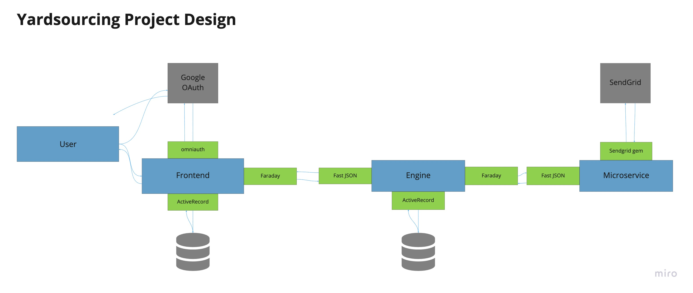
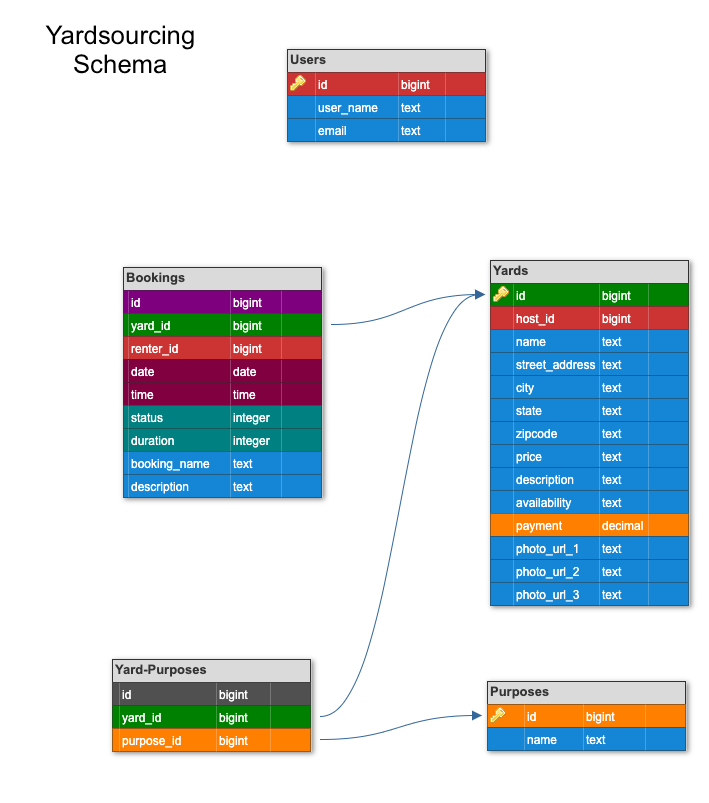

# Yardsourcing

Have you ever been sitting in your 5th floor apartment wishing you could bask in the sun on a lawn chair? Now you can and you don't even need to leave your city! Do you need some spare cash and have own a private outdoor space? If you answered yes to either of these quetions, you need **Yardsourcing**!

Yardsourcing is a web application that allows users to create accounts via Google login, browse yards available for rent by location or list their own outdoor space! Whether you need a pet friendly yard, a party yard or a place to do your outdoor hobby - Yardsourcing has you covered!

*Turn your extra green into green.*

#### Related Repos
To explore the full web application, please visit the built out back end application that hooks into this front end and its views.
 - [Yardsourcing - engine](https://github.com/Yardsourcing/yardsourcing-engine).

To set up automatic email confirmation, please visit the Sendgrid microservice.
 - [Sendgrid Microservice](https://github.com/Yardsourcing/yardsourcing-sendgrid)

### Created by:
- [Alexa Morales Smyth](https://github.com/amsmyth1) | [LinkedIn](https://www.linkedin.com/in/moralesalexa/)
- [Angel Breaux](https://github.com/abreaux26) | [LinkedIn](https://www.linkedin.com/in/angel-breaux)
- [Doug Welchons](https://github.com/DougWelchons/) | [LinkedIn](https://www.linkedin.com/in/douglas-welchons)
- [Dominic Padula](https://github.com/domo2192) | [LinkedIn](https://www.linkedin.com/in/dominic-padula)
- [Genevieve Nuebel](https://github.com/Gvieve) | [LinkedIn](https://www.linkedin.com/in/genevieve-nuebel)
- [Jenny Branham](https://github.com/jbranham1) | [LinkedIn](https://www.linkedin.com/in/jenny-branham)
- [Jordan Beck](https://github.com/jordanfbeck0528) | [LinkedIn](https://www.linkedin.com/in/jordan-f-beck/)

#### Built With
* [Ruby on Rails](https://rubyonrails.org)
* [HTML](https://html.com)
* [JavaScript](https://www.javascript.com)
* [Bootstrap](https://getbootstrap.com/)

This project was tested with:
* RSpec version 3.10

## Contents
- [Getting Started](#getting-started)
  - [Prerequisites](#prerequisites)
  - [Installing](#installing)
- [Database Schema](#database-schema)  
- [Application Features](#application-features)
  - [OmniAuth and Google](#omniauth-and-google-integrations)
- [Testing](#testing)
- [How to Contribute](#how-to-contribute)
- [Roadmap](#roadmap)
- [Contributors](#contributors)
- [Acknowledgments](#acknowledgments)

### Getting Started

These instructions will get you a copy of the project up and running on your local machine for development and testing purposes. See deployment for notes on how to deploy the project on a live system.

#### Prerequisites

* __Ruby__

  - The project is built with rubyonrails using __ruby version 2.5.3p105__, you must install ruby on your local machine first. Please visit the [ruby](https://www.ruby-lang.org/en/documentation/installation/) home page to get set up. _Please ensure you install the version of ruby noted above._

* __Rails__
  ```sh
  gem install rails --version 5.2.5
  ```

* __Postgres database__
  - Visit the [postgresapp](https://postgresapp.com/downloads.html) homepage and follow their instructions to download the latest version of Postgres app.

* __Google Oauth API__
  - Visit the [google developer tools](https://console.developers.google.com/project) to create an account and follow the instructions to create a project for your server to obtain a client_id and client_secret.

* __Omniauth for Rails__
  Visit the [google api omniauth](https://www.twilio.com/blog/2014/09/gmail-api-oauth-rails.html) homepage and follow their instructions to get familiar with how to use Omniauth in a rails application.


#### Installing

1. Clone the repo
  ```
  $ git clone https://github.com/Yardsourcing/yardsourcing-frontend
  ```

2. Bundle Install
  ```
  $ bundle install
  ```

3. Create, migrate and seed rails database
  ```
  $ rails db:{create,migrate,seed}
  ```

  If you do not wish to use the sample data provided to seed your database, replace the commands in `db/seeds.rb` and the data dump file in `db/data/rails-engine-development.pgdump`.

  4. Create your google environment variables. Run the below command to create an application.yml that is included in the .gitignore file.
  ```sh
  $ bundle exec figaro install
  ```

  5. Open the application.yml file in your text editor, in the example below it is using atom as the text editor.
  ```sh
  $ atom config/application.yml
  ```

  4. Set up Environment Variables
    - run `bundle exec figaro install`
    - add the below variables to the `config/application.yml`
  ```
  GOOGLE_CLIENT_ID: '<GOOGLE_CLIENT_ID>'
  GOOGLE_CLIENT_SECRET: '<GOOGLE_CLIENT_SECRET>'
  ys_engine_url: 'http://localhost:3001'
  mapquest_key: '<MAPQUEST_KEY>'
  google_api_key: '<GOOGLE_MAPS_API_KEY>'
  ```

  7. Start rails server
  ```sh
  $ rails s
  ```

### Project Architecture
<p style="text-align:center;"></p>

### Database Schema
<p style="text-align:center;"></p>

### Application Features

##### OmniAuth and Google Integrations
- OmniAuth and Google Integration

##### Host Yard Create, Delete, Update
- Each authenticated user has the ability to be a Host or a Renter
  - As a Host
    - The Host Dashboard is the landing page for all the hosts yards for rent and upcoming bookings (pending and accepted)
    - Host Yards
      - Create new yards to list for rent. Fill in the associated attributes, including price per hour, available for <purposes>, location, photos urls and more.
      - View the yard and its details on the show page
      - Update existing yards
      - Delete existing yards
    - Host Bookings
      - The host is notified about the new pending booking via email.
      - The host can view their pending bookings on their dashboard. There they can approve or deny the booking request.
      - The host can cancel a booking within 48 hours of the start time.
  - As a Renter
    - The Renter Dashboard is the landing page for all the pending and approved bookings for the user.
    - Search Yards
      - As a User I can visit the search page and find yards by zipcode and purpose
      - The results are generated on a new page and displaye via pins in an embedded googlemap and listed with details below the map.
      - Another search can be called from the results page.
    - Request a Booking
      - Once a yard is found that matches the user's criteria, they can click a button to book the yard.
      - Fill in required booking request details and click submit. Wait for the host to approve!  


### Testing
##### Running Tests
- To run the full test suite run the below in your terminal:
```
$ bundle exec rspec
```
- To run an individual test file run the below in tour terminal:
```
$ bundle exec rspec <file path>
```
for example: `bundle exec rspec spec/features/host/dashboard/index_spec.rb`

### How to Contribute

In the spirit of collaboration, things done together are better than done on our own. If you have any amazing ideas or contributions on how we can improve this API they are **greatly appreciated**. To contribute:

  1. Fork the Project
  2. Create your Feature Branch (`git checkout -b feature/AmazingFeature`)
  3. Commit your Changes (`git commit -m 'Add some AmazingFeature'`)
  4. Push to the Branch (`git push origin feature/AmazingFeature`)
  5. Open a Pull Request

### Roadmap

See the [open issues](https://github.com/Yardsourcing/yardsourcing-frontend/issues) for a list of proposed features (and known issues). Please open an issue ticket if you see an existing error or bug.

### Contributors
- [Alexa Morales Smyth](https://github.com/amsmyth1)
- [Angel Breaux](https://github.com/abreaux26)
- [Doug Welchons](https://github.com/DougWelchons/)
- [Dominic Padula](https://github.com/domo2192)
- [Genevieve Nuebel](https://github.com/Gvieve)
- [Jenny Branham](https://github.com/jbranham1)
- [Jordan Beck](https://github.com/jordanfbeck0528)

  See also the list of
  [contributors](https://github.com/Yardsourcing/yardsourcing-frontend/graphs/contributors)
  who participated in this project.

### Acknowledgments
- Our fantastically wizard like Project Manager and Instructor at [Turing School of Software and Design](https://turing.io/):
  * Ian Douglas
